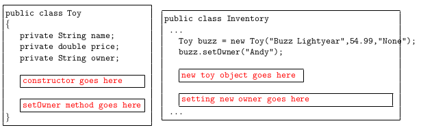

## CMPSC 100-01 Final Exam
### Fall 2019
## Name:


### Question 1 [15 points]
Something is wrong with each of these loops. In some cases the errors will cause the compiler to
emit error messages and prevent you from executing the program. In others, the program
will compile without error, but the effectiveness of the loop is negated by the error. (NOTE:
assume that all variables are properly declared and initialized -- the errors lie in the formation
of the loop statements themselves, not elsewhere in the program.)

Find the errors and fix them.

(a)
```
for (int count == 3; count < 10; count++) {
   sum = sum + count;
}
```

(b)
```
for (int count = 0, count < 10, count = count + 1) {
  sum = sum + count;
}
```

(c)
```
int count = 3;
do {
    sum = count;
    if (sum % 3 != 0) {
	count++; 
    }
} while (count <= 3);
```

(d)
```
for (int count = 0; count <= 10) {
  sum = sum + count;
}
```

(e)
```
do (int count = 0) {
    sum = sum + count;
} while (count < 10);
```

### Question 2 [10 points]
Assume the following variable declarations in the class named `Thing`.

```
private int var1;
private double var2;
private String var3;
private boolean var4;
```

(a) Write a four-parameter constructor that initializes the instance variables to the values provided in the parameters; order the parameters in the same order in which the variables were declared above.

(b) Write a statement to create a new `Thing` object with initial values of 11 for `var1`, 2.4 for `var2`, "Hello" for `var3`, and true for `var4`.

### Question 3 [15 points]
Study the following Java code snippet, then answer the questions below.

```
ArrayList<String> list = new ArrayList<String>();
list.add("bat");
list.add("cat");
list.add("dog");
list.add("frog");
```

(a) What is the value of `list.indexOf("bat")`?

(b) What is the value of `list.size()`?

(c) What is the value of `list.contains("og")`?

(d) What is the value of `list.get(1).contains("at")`?

(e) What is the value of `list.get(3).equals("dog")`?

### Question 4 [5 points]
Convert the following do while loop into an equivalent for loop.
```
int count = 100;
do {
   System.out.println(count);
   count -= 10;
} while (count >= 0);
```

### Question 5 [5 points]

Write the Java statements needed to create a new `ArrayList` containing integer values and to fill it with the first 100 positive even integers, starting with 2. Must use a loop.


### Question 6 [5 points]
Suppose a Java class contains instance variables declared below. Assume the values of these variables have been assigned elsewhere in the program. Write a method called `setTriple` that changes the number stored in the variable 'value' to the triple that number ('value' multiplied by three) but only if 'tripleUp' is true. Nothing happens otherwise. Nothing is returned. 

``` 
private boolean tripleUp;
private int value;
```

### Question 7 [15 points]



The left figure below shows a class describing a `Toy`. The constructor is missing. The right figure shows how an object of the class `Toy` is constructed. `setOwner` method allows to change the owner of the toy. All toys initially have no owners (value set to "None") until it is changed by the 'setOwner' method.

(a) Write the constructor that creates a `Toy` object of specific name, price, owner (in that order). 

(b) Write the `setOwner` method that takes a String as a parameter and modifies the `owner` to that String literal. 

(c) Create a different `Toy` object of your choosing.


### Question 8 [5 points]
True or False. Put x inside brackets to indicate the chosen answer.

(a) Square brackets "[ ]" are used in the declaration of an ArrayList.
[ ] True
[ ] False


(b) UML diagram contains information about all instance variables of a class.
[ ] True
[ ] False


(c) An array is a dynamic data structure.
[ ] True
[ ] False


(d) Abstraction is one of computational thinking techniques.
[ ] True
[ ] False


(e) GitHub is a version control software platform.
[ ] True
[ ] False


### Question 9 [10 points]
Given the following Java declaration:
```
        int [ ] nums = new int[100];
```
Write the Java statements needed to fill `nums` with the values of
the first 100 positive multiples of 5, that is, 5, 10, 15, etc. Must use a loop.


### Question 10 [5 points]

What is the output of the following code segment:

```
    ArrayList<String> list = new ArrayList<String>();
    
    list.add("Oberlin College");
    list.add("Allegheny College");
    list.add("Kenyon College");
    list.add("Albion College");
    list.add("Hope College");
    list.add("The College of Wooster");
    
    Iterator<String> iterator = list.iterator();
    while(iterator.hasNext()) {
      String name = iterator.next();
      switch(name) {
    	case "Oberlin College":
	case "Kenyon College":
	case "The College of Wooster":
    	    System.out.println(name + "in OH");
    	    break;
    	case "Allegheny College":
    	    System.out.println(name + "in PA");
    	    break;
    	case "Albion College":
	case "Hope College":
    	    System.out.println("in MI");
    	    break;
    	case "default":
    	    System.out.println("Not Found");
    	    break;
      }
    }
```


### Question 11 [5 points]
In a few sentences describe one example of how computer science can be applied to and used in another field.


### Question 12 [5 points]
In a few sentences either describe how computational mode of expression (using computation for expression) can be used to create meaning and communicate thoughts, emotions, or beliefs to others or argue how it does not accomplish this goal. 